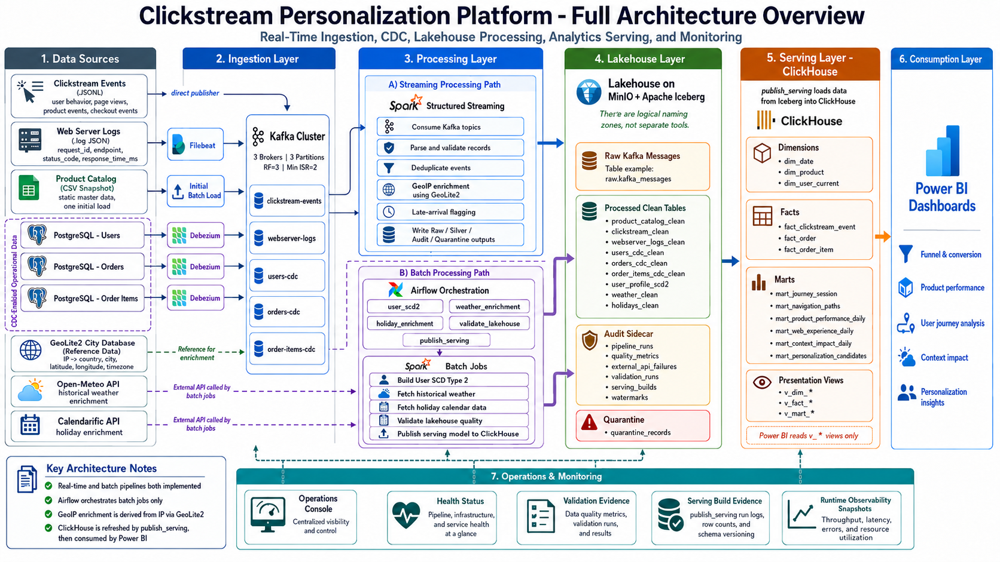
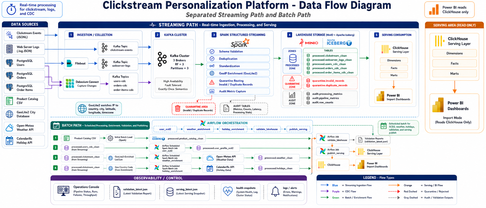
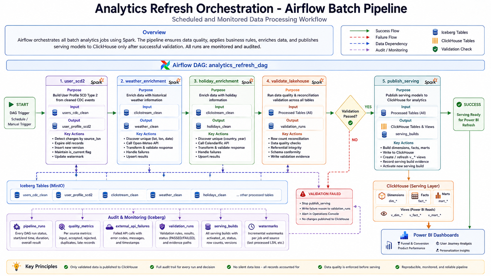
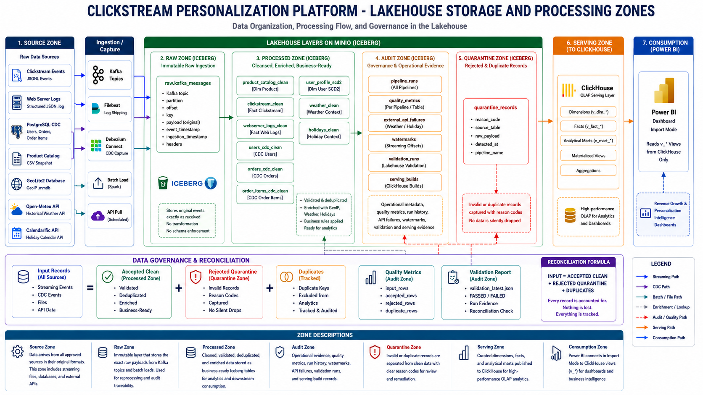
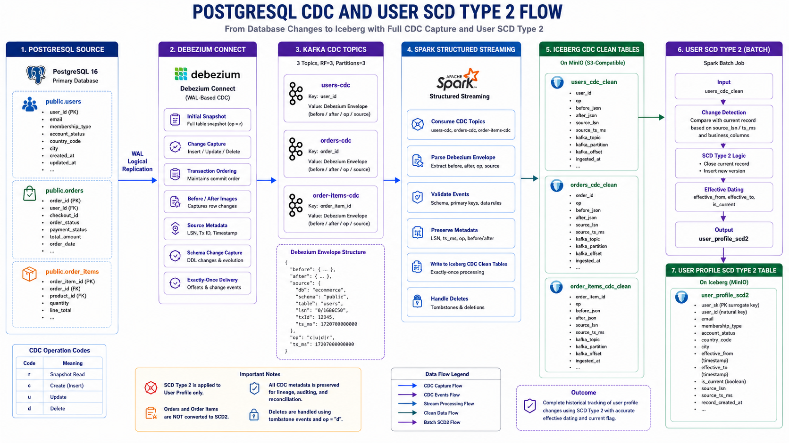
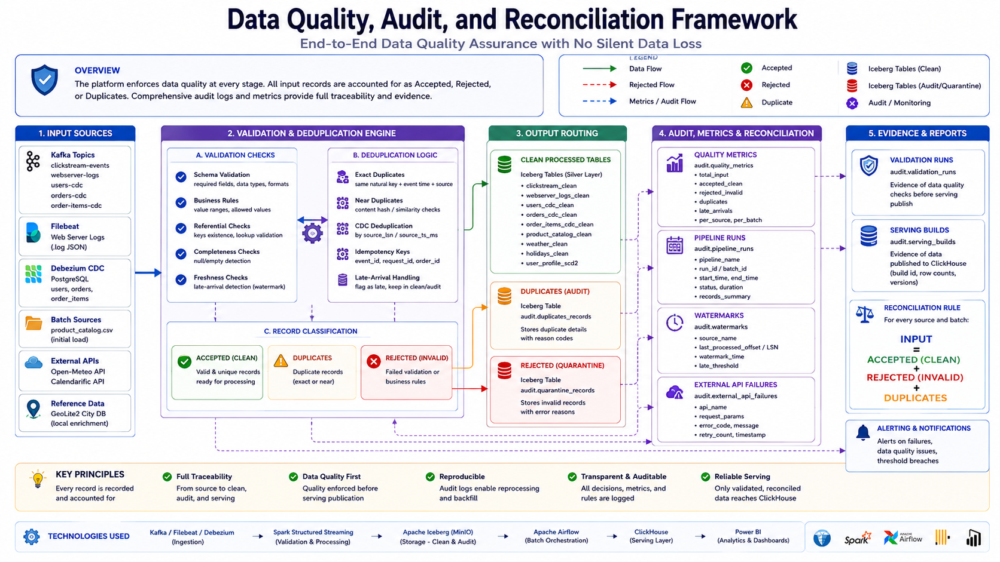
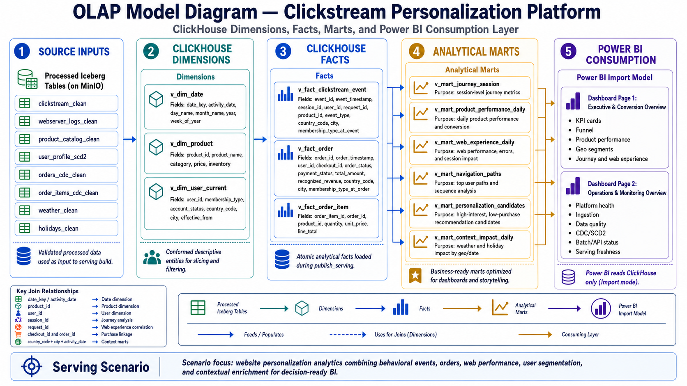
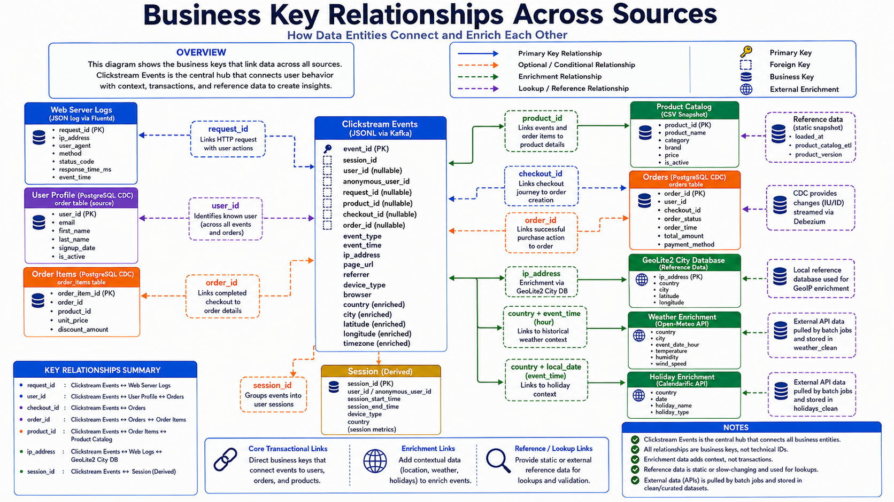
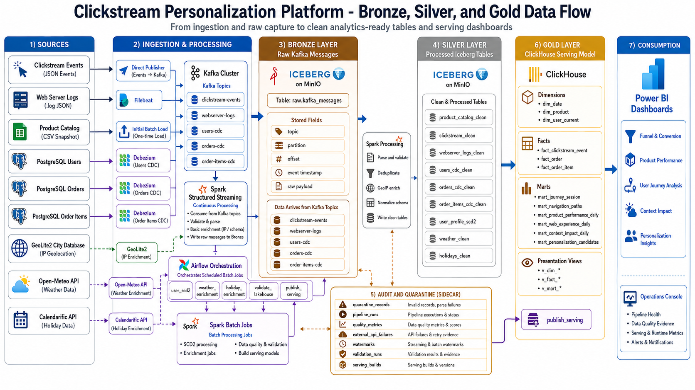

# Project Architecture

## Purpose

**Clickstream Personalization Platform** implements an end-to-end data engineering architecture for behavioral analytics, user journey intelligence, contextual enrichment, personalization signals, and Power BI reporting.

The platform is organized around a clear separation of responsibilities:

```text
Source systems
  → Ingestion services
  → Streaming and batch processing
  → Iceberg lakehouse storage
  → ClickHouse serving layer
  → Power BI dashboard
  → Operations and validation evidence
```

This architecture is designed to keep raw ingestion, data cleaning, enrichment, quality validation, analytical serving, and business reporting independent from each other. Each layer has a defined responsibility and a stable contract with the next layer.

---

## Architecture Overview



The platform integrates behavioral, operational, transactional, reference, and contextual data sources into a local containerized data platform.

The high-level flow is:

```text
Clickstream Events
Web Server Logs
PostgreSQL CDC
Product Catalog
GeoIP Database
Weather API
Holiday API
        ↓
Kafka / Debezium / Filebeat / Spark Batch
        ↓
Spark Structured Streaming + Spark Batch
        ↓
Apache Iceberg on MinIO
        ↓
ClickHouse Serving Layer
        ↓
Power BI Dashboard
```

The architecture separates continuous ingestion from scheduled analytical refreshes. Streaming jobs process high-frequency Kafka topics into the lakehouse, while Airflow-triggered batch jobs build slowly changing dimensions, contextual enrichments, validation evidence, and serving outputs.

---

## Platform Layers

| Layer | Responsibility | Main Components |
|---|---|---|
| Source Layer | Generates and stores source data before ingestion. | Local JSONL generators, `.log` web logs, PostgreSQL, CSV reference data, GeoIP database, external APIs |
| Ingestion Layer | Moves source records into streaming or batch processing paths. | Kafka, Filebeat, Debezium Connect, Spark batch loaders |
| Processing Layer | Validates, cleans, enriches, deduplicates, and structures data. | Spark Structured Streaming, Spark Batch |
| Lakehouse Layer | Stores raw, processed, quarantine, and audit data in table format. | Apache Iceberg, MinIO, PostgreSQL Iceberg catalog |
| Orchestration Layer | Coordinates scheduled analytical jobs. | Apache Airflow |
| Serving Layer | Publishes dashboard-ready analytical data. | ClickHouse |
| Analytics Layer | Presents business metrics and analytical scenarios. | Power BI |
| Operations Layer | Surfaces health, validation, and serving evidence. | Streamlit Operations Console, JSON reports, audit tables |

---

## Source Layer

The project integrates multiple source categories to represent a realistic e-commerce analytics environment.

| Source | Type | Role |
|---|---|---|
| Clickstream Events | Behavioral event stream | Captures user activity such as page views, product views, cart events, search, checkout, login, logout, and scroll behavior. |
| Web Server Logs | Operational request logs | Captures HTTP request paths, methods, status codes, latency, request IDs, user agents, and IP addresses. |
| Product Catalog | Static reference CSV | Provides product attributes such as product ID, name, category, price, and inventory. |
| PostgreSQL Users | Transactional source table | Stores user profile and account data. |
| PostgreSQL Orders | Transactional source table | Stores order-level transactional records. |
| PostgreSQL Order Items | Transactional source table | Stores product-level line items for orders. |
| GeoIP Database | Local enrichment reference | Converts IP addresses into country, city, coordinate, and timezone context. |
| Weather API | External context source | Provides weather observations for analytical context. |
| Holiday API | External context source | Provides country-level holiday context for behavioral analysis. |

The architecture intentionally uses heterogeneous sources: file-based events, log shipping, relational CDC, reference CSV, local enrichment database, and scheduled external API pulls.

---

## Ingestion Architecture



The ingestion design uses two main patterns:

1. **Streaming ingestion**
2. **Scheduled batch ingestion**

### Streaming Ingestion

Streaming ingestion is used for sources that behave like continuously arriving operational data.

| Source | Ingestion Path | Kafka Topic |
|---|---|---|
| Clickstream Events | Local publisher → Kafka | `clickstream-events` |
| Web Server Logs | Filebeat → Kafka | `webserver-logs` |
| Users CDC | PostgreSQL → Debezium → Kafka | `users-cdc` |
| Orders CDC | PostgreSQL → Debezium → Kafka | `orders-cdc` |
| Order Items CDC | PostgreSQL → Debezium → Kafka | `order-items-cdc` |

Kafka acts as the streaming backbone between operational sources and Spark Structured Streaming.

The Kafka deployment uses three brokers to model a resilient local streaming environment:

```text
kafka1
kafka2
kafka3
```

Business topics use partitioning and replication suitable for the local platform contract.

### Scheduled Batch Ingestion

Scheduled batch ingestion is used for reference and contextual data.

| Source | Ingestion Path | Target |
|---|---|---|
| Product Catalog | Spark batch load | `ecommerce.processed.product_catalog_clean` |
| GeoIP Database | Spark enrichment reference | Clickstream and web log enrichment |
| Weather API | Airflow-triggered Spark batch | `ecommerce.processed.weather_clean` |
| Holiday API | Airflow-triggered Spark batch | `ecommerce.processed.holidays_clean` |

The product catalog is treated as a static reference source. It is loaded directly into the lakehouse and used by downstream serving jobs.

---

## Streaming Processing Architecture

Spark Structured Streaming is responsible for processing Kafka topics into Iceberg tables.

The streaming path handles:

```text
Kafka topics
  → Raw payload preservation
  → Parsing
  → Validation
  → Deduplication
  → GeoIP enrichment
  → CDC normalization
  → Clean Iceberg tables
  → Quarantine and audit tables
```

### Streaming Responsibilities

| Responsibility | Description |
|---|---|
| Raw capture | Kafka messages are preserved in a unified raw Iceberg table with topic, partition, offset, key, value, and ingestion metadata. |
| Schema parsing | JSON payloads are parsed into structured records according to the source contract. |
| Validation | Required identifiers, event types, timestamps, and source-specific rules are checked before clean publication. |
| Deduplication | Duplicate event records are identified and routed according to the quality model. |
| Quarantine | Invalid or duplicate records are written to audit evidence instead of being silently discarded. |
| GeoIP enrichment | IP-derived country, city, latitude, longitude, timezone, and location context are attached where available. |
| CDC normalization | Debezium messages are transformed into clean CDC event tables. |
| Metrics | Pipeline runs, watermarks, and quality metrics are recorded for operational evidence. |

The streaming layer does not publish directly to Power BI. Its role is to maintain validated lakehouse tables that become the foundation for scheduled serving publication.

---

## Batch Processing Architecture

Airflow coordinates scheduled Spark batch jobs through the `analytics_refresh` workflow.



The analytical refresh includes:

```text
user_scd2
weather_enrichment
holiday_enrichment
validate_lakehouse
publish_serving
```

### Batch Job Responsibilities

| Job | Responsibility |
|---|---|
| `user_scd2` | Builds the current and historical user profile dimension from clean user CDC events. |
| `weather_enrichment` | Enriches observed location and hour combinations with weather context. |
| `holiday_enrichment` | Enriches country and date combinations with holiday context. |
| `validate_lakehouse` | Validates lakehouse quality, record reconciliation, relationships, and audit expectations. |
| `publish_serving` | Publishes curated dimensions, facts, marts, and stable `v_*` views to ClickHouse. |

The batch design separates operational ingestion from analytical publication. This keeps streaming focused on continuous ingestion and makes serving publication versioned, validated, and reproducible.

---

## Lakehouse Architecture



Apache Iceberg provides the table layer for the lakehouse, while MinIO provides S3-compatible object storage.

The Iceberg warehouse is organized around three logical zones:

```text
ecommerce.raw
ecommerce.processed
ecommerce.audit
```

### Raw Zone

The raw zone preserves Kafka messages before source-specific transformations.

| Table | Purpose |
|---|---|
| `raw.kafka_messages` | Unified raw landing table for Kafka messages from clickstream, web logs, and CDC topics. |

The raw table supports lineage, replay analysis, offset-level tracing, and ingestion evidence.

### Processed Zone

The processed zone contains clean, validated, deduplicated, and enriched analytical tables.

| Table | Purpose |
|---|---|
| `processed.product_catalog_clean` | Static product reference table. |
| `processed.clickstream_clean` | Validated and enriched behavioral event table. |
| `processed.webserver_logs_clean` | Validated and enriched web request table. |
| `processed.users_cdc_clean` | Clean Debezium CDC event history for users. |
| `processed.orders_cdc_clean` | Clean Debezium CDC event history for orders. |
| `processed.order_items_cdc_clean` | Clean Debezium CDC event history for order items. |
| `processed.user_profile_scd2` | SCD Type 2 user profile dimension. |
| `processed.weather_clean` | Weather context table. |
| `processed.holidays_clean` | Holiday context table. |

### Audit Zone

The audit zone contains operational and validation evidence.

| Table | Purpose |
|---|---|
| `audit.pipeline_runs` | Pipeline run records and execution status. |
| `audit.quality_metrics` | Accepted, rejected, duplicate, and processed record metrics. |
| `audit.external_api_failures` | External API failure records and retry evidence. |
| `audit.validation_runs` | Lakehouse validation results. |
| `audit.serving_builds` | Serving build history and activation evidence. |
| `audit.watermarks` | Streaming and batch watermark tracking. |
| `audit.quarantine_records` | Invalid and duplicate record evidence. |

---

## Storage and Table Design

The lakehouse uses Iceberg tables with partitioning aligned to analytical access patterns.

| Table | Partition Strategy |
|---|---|
| `raw.kafka_messages` | `days(ingested_at), source_name` |
| `processed.product_catalog_clean` | `category` |
| `processed.clickstream_clean` | `days(event_timestamp)` |
| `processed.webserver_logs_clean` | `days(log_timestamp)` |
| `processed.users_cdc_clean` | `days(processed_at)` |
| `processed.orders_cdc_clean` | `days(processed_at)` |
| `processed.order_items_cdc_clean` | `days(processed_at)` |
| `processed.user_profile_scd2` | `days(effective_from)` |
| `processed.weather_clean` | `days(weather_hour)` |
| `processed.holidays_clean` | `year` |
| `audit.pipeline_runs` | `days(recorded_at)` |
| `audit.quality_metrics` | `days(recorded_at)` |
| `audit.quarantine_records` | `days(quarantined_at), source_name` |
| `audit.external_api_failures` | `days(occurred_at)` |
| `audit.watermarks` | `days(updated_at)` |
| `audit.validation_runs` | `days(created_at)` |
| `audit.serving_builds` | `days(created_at)` |

The lakehouse design combines structured table management, partition pruning, Parquet storage, compression, and auditability.

---

## CDC and SCD Type 2 Architecture



PostgreSQL transactional tables are captured through Debezium and delivered to Kafka as CDC streams.

CDC topics:

```text
users-cdc
orders-cdc
order-items-cdc
```

The architecture distinguishes between clean CDC event history and analytical dimensional history.

| Table | Role |
|---|---|
| `users_cdc_clean` | Clean CDC event history for user changes. |
| `orders_cdc_clean` | Clean CDC event history for order changes. |
| `order_items_cdc_clean` | Clean CDC event history for order-item changes. |
| `user_profile_scd2` | Analytical user profile dimension with current and historical versions. |

SCD Type 2 is applied to user profile data because user attributes can change over time and historical analysis requires the correct user state at the time of activity.

The SCD2 dimension maintains:

```text
effective_from
effective_to
is_current
source_lsn
source_ts_ms
```

This design preserves CDC lineage while providing a clean current-user dimension for serving and reporting.

---

## Data Quality Architecture



Data quality is implemented as part of the pipeline, not as a separate afterthought.

The quality model follows this reconciliation contract:

```text
Input records = Accepted records + Rejected records + Duplicate records
```

### Quality Responsibilities

| Area | Description |
|---|---|
| Required identifiers | Ensures key fields such as event ID, session ID, event type, request ID, and source-specific identifiers are present. |
| Event rules | Enforces event-specific requirements such as product IDs for product events and checkout IDs for checkout events. |
| CDC structure | Validates CDC envelopes and normalizes source metadata. |
| Deduplication | Detects duplicate source records and records evidence. |
| Quarantine | Stores invalid and duplicate records with reason codes. |
| Metrics | Records accepted, rejected, duplicate, and processed counts. |
| Validation | Checks lakehouse consistency, relationship coverage, SCD2 state, and serving readiness. |

The audit model makes pipeline behavior explainable and verifiable through structured evidence tables.

---

## Serving Architecture



ClickHouse is the analytical serving layer for Power BI.

The serving database is:

```text
personalization_olap
```

Spark publishes physical dimensions, facts, and marts into ClickHouse. Stable `v_*` views expose the latest active serving build to Power BI.

### Serving View Contract

| Category | Views |
|---|---|
| Dimensions | `v_dim_date`, `v_dim_product`, `v_dim_user_current` |
| Facts | `v_fact_clickstream_event`, `v_fact_order`, `v_fact_order_item` |
| Journey Marts | `v_mart_journey_session`, `v_mart_navigation_paths` |
| Product and Experience Marts | `v_mart_product_performance_daily`, `v_mart_web_experience_daily` |
| Context and Personalization Marts | `v_mart_context_impact_daily`, `v_mart_personalization_candidates` |

The serving layer intentionally exposes twelve curated views. These views form the analytical contract consumed by Power BI.

---

## Power BI Architecture

Power BI connects to ClickHouse in Import mode and reads the curated `v_*` serving views.

```text
ClickHouse v_* views
        ↓
Power BI Import model
        ↓
DAX measures and semantic modeling
        ↓
Business dashboard pages
```

Dashboard-specific calculations, ratios, funnel metrics, and presentation-level measures are implemented in Power BI. ClickHouse remains the clean serving contract and does not expose raw, audit, or internal operational tables to the report.

The Power BI file is stored at:

```text
power_BI_dashboard/project_clickstream.pbix
```

Dashboard evidence is stored under:

```text
screenshots/
```

---

## Operations Architecture

The platform includes operational visibility through CLI reports, JSON evidence files, audit tables, and a Streamlit Operations Console.

The Operations Console summarizes:

```text
Docker service health
Kafka and CDC state
Spark streaming status
Iceberg table evidence
Data quality status
SCD Type 2 status
Batch enrichment status
ClickHouse serving readiness
Power BI view availability
```

This layer is read-only and provides operational evidence without modifying data.

---

## Business Key Architecture



The architecture relies on stable business keys to connect behavioral, operational, transactional, contextual, and reference data.

| Key | Role |
|---|---|
| `event_id` | Unique clickstream event identifier. |
| `request_id` | Links clickstream activity with web server logs. |
| `session_id` | Groups user activity into journeys. |
| `visitor_id` | Tracks visitor behavior before or alongside known user identification. |
| `user_id` | Links users, sessions, orders, and profile history. |
| `checkout_id` | Connects checkout activity with order records. |
| `order_id` | Links orders and order items. |
| `product_id` | Connects product events, order items, product catalog, and product marts. |
| `event_timestamp` | Supports event ordering, date dimensions, and time-based analysis. |

These relationships allow the serving layer to support journey, funnel, revenue, product, personalization, and context analytics.

---

## Bronze, Silver, and Gold Model



The project follows a lakehouse-style progression:

| Layer | Project Mapping | Purpose |
|---|---|---|
| Bronze | `ecommerce.raw` | Preserve raw Kafka messages and ingestion metadata. |
| Silver | `ecommerce.processed` | Store clean, validated, enriched, and structured analytical data. |
| Gold | ClickHouse serving layer | Publish dashboard-ready dimensions, facts, marts, and stable views. |
| Consumption | Power BI | Present business-facing analytics and decision reporting. |

Power BI is the consumption layer, while ClickHouse acts as the governed analytical serving layer.

---

## Deployment Topology

The platform runs as a local Docker Compose environment.

Core services include:

| Service | Role |
|---|---|
| `postgres` | Transactional source system and Iceberg JDBC catalog backend. |
| `zookeeper` | Kafka coordination. |
| `kafka1`, `kafka2`, `kafka3` | Kafka broker cluster. |
| `kafka-ui` | Kafka topic and consumer visibility. |
| `debezium` | CDC connector runtime. |
| `minio` | Object storage for the Iceberg warehouse. |
| `filebeat` | Web server log shipper. |
| `spark-engine` | Spark runtime for streaming and batch jobs. |
| `airflow` | Batch orchestration. |
| `clickhouse` | OLAP serving database. |
| `observability-ui` | Streamlit Operations Console. |

The environment is controlled through:

```text
main.py
docker-compose.yml
config/
spark_jobs/
src/platform_core/
```

---

## Run Lifecycle

The platform supports a structured lifecycle through the main CLI.

| Command | Purpose |
|---|---|
| `python main.py init` | Creates a clean first-run platform state, initializes services, loads sources, starts streaming, applies controlled CDC mutations, validates the lakehouse, and publishes serving outputs. |
| `python main.py start` | Starts an existing preserved local platform state. |
| `python main.py status` | Reports service health, streaming state, validation state, and active serving build. |
| `python main.py stop` | Stops containers while preserving local project state. |
| `python main.py reset --confirm` | Removes generated runtime state and returns the project to a clean first-run state. |

This lifecycle keeps first-run initialization, ongoing startup, status inspection, shutdown, and reset behavior explicit.

---

## Final Architecture Contract

The final project architecture is defined by the following contract:

```text
Heterogeneous sources
  → Kafka / Filebeat / Debezium / Spark batch ingestion
  → Spark Structured Streaming and Spark Batch
  → Apache Iceberg lakehouse on MinIO
  → ClickHouse physical serving tables
  → Twelve stable ClickHouse v_* views
  → Power BI Import dashboard
```

The project keeps raw data, processed data, audit evidence, serving data, and dashboard presentation responsibilities separated.

The Power BI layer consumes curated ClickHouse views only. Dashboard-specific calculations are implemented in Power BI, while ClickHouse remains the stable analytical serving interface.
