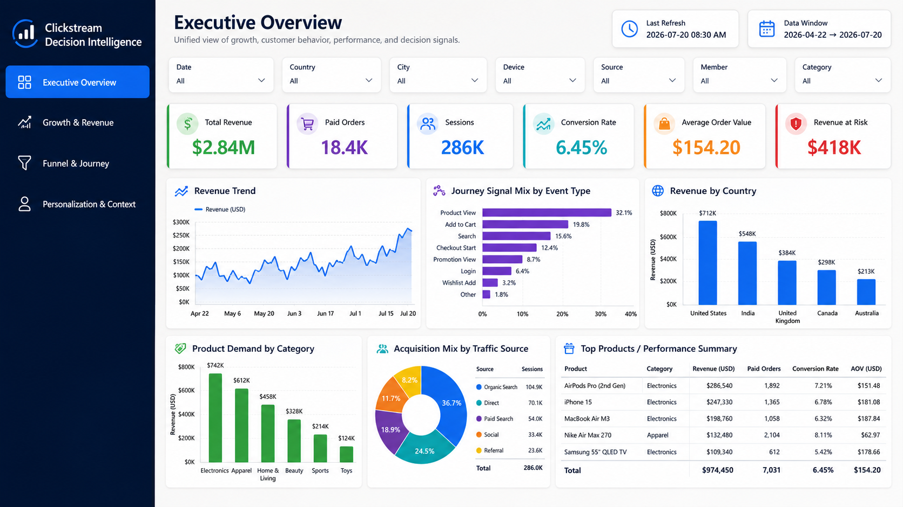
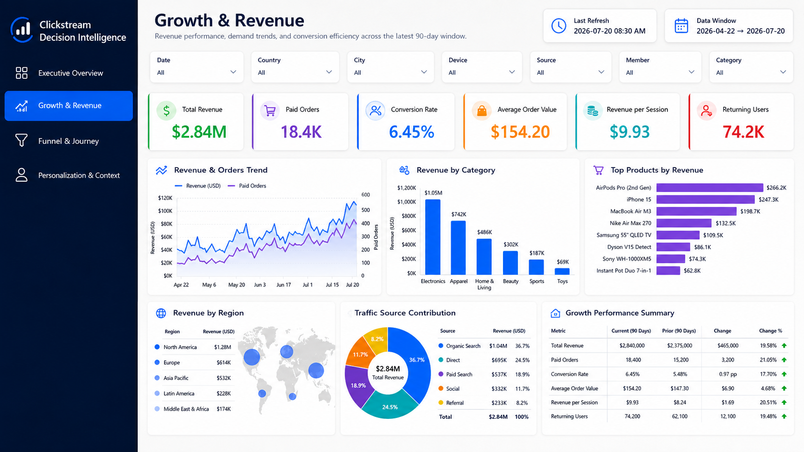
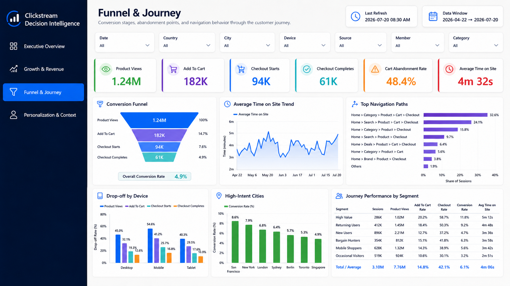
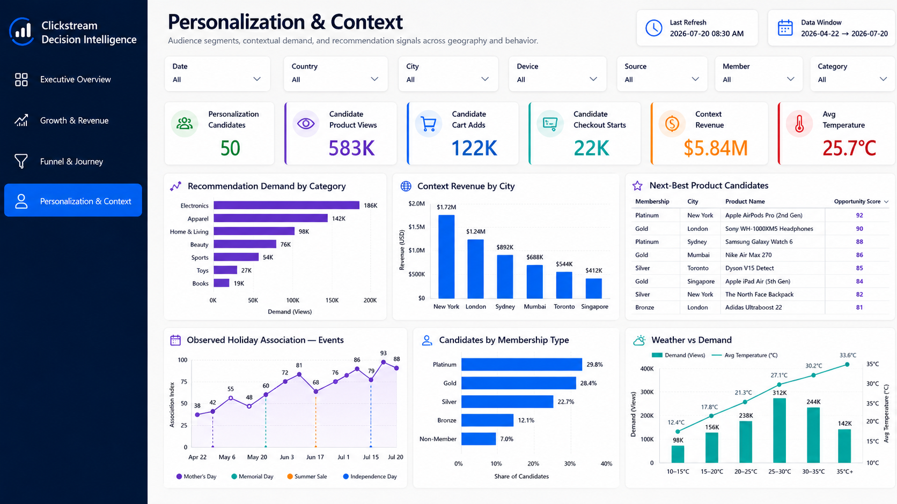
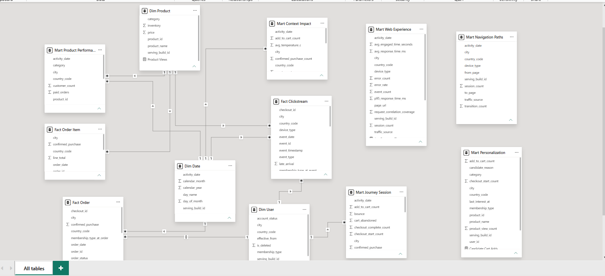

# Serving and Dashboards

## Purpose

This document describes the analytical serving layer and Power BI reporting model used by **Clickstream Personalization Platform**.

The serving layer converts trusted Iceberg lakehouse data into curated ClickHouse tables and stable Power BI-facing views. Power BI consumes these views in Import mode and implements dashboard-specific calculations inside the report semantic model.

The final reporting contract is intentionally clean:

```text
Apache Iceberg lakehouse
  → Spark publish_serving job
  → ClickHouse physical serving tables
  → Stable ClickHouse v_* views
  → Power BI Import model
  → Business dashboard pages
```

Power BI reads curated ClickHouse views only. Raw, processed, audit, and internal operational tables remain outside the dashboard model.

---

## Serving Architecture


ClickHouse acts as the OLAP serving database for dashboard-ready data.

```text
Database: personalization_olap
```

The serving architecture is built around three responsibilities:

| Responsibility | Description |
|---|---|
| Publish analytical outputs | Spark builds dimensions, facts, and marts from trusted lakehouse data. |
| Version serving builds | Each publication is assigned a `serving_build_id` for consistency and traceability. |
| Expose stable views | Power BI connects to stable `v_*` views that represent the latest active serving build. |

This design keeps Power BI independent from internal processing tables and allows the serving layer to control the analytical contract.

---

## Serving Publication Flow

The serving publication is handled by the Spark batch job:

```text
publish_serving
```

The job runs as part of the Airflow analytical refresh workflow.

```text
Iceberg processed tables
  → Spark serving transformations
  → ClickHouse physical serving tables
  → serving_control active build
  → stable ClickHouse v_* views
  → Power BI
```

### Publication Responsibilities

| Step | Responsibility |
|---|---|
| Read lakehouse tables | Load clean processed Iceberg tables and analytical outputs. |
| Build dimensions | Publish date, product, and current user dimensions. |
| Build facts | Publish clickstream, order, and order item facts. |
| Build marts | Publish journey, navigation, product, web experience, context, and personalization marts. |
| Attach build ID | Add `serving_build_id` to serving records. |
| Activate build | Register the successful build in ClickHouse `serving_control`. |
| Validate serving views | Confirm that all Power BI-facing views are available. |
| Record evidence | Write serving build evidence to Iceberg audit tables and JSON reports. |

---

## Serving Build Versioning

The serving layer uses build versioning to keep dashboard outputs consistent.

Each serving publication generates a build identifier such as:

```text
build_YYYYMMDDTHHMMSSZ__serving
```

Physical ClickHouse tables store records with:

```text
serving_build_id
```

Stable views expose the latest active build through `serving_control`.

This pattern gives the platform a clear separation between:

| Layer | Role |
|---|---|
| Physical serving tables | Store versioned analytical outputs. |
| `serving_control` | Identifies the active serving build. |
| `v_*` views | Expose the active build to Power BI. |

Power BI connects to the stable `v_*` views rather than build-specific tables.

---

## Final Power BI View Contract

The final ClickHouse-to-Power BI contract contains twelve curated views.

| Category | View | Purpose |
|---|---|---|
| Dimension | `v_dim_date` | Date dimension used for calendar filtering and time-based analysis. |
| Dimension | `v_dim_product` | Product dimension with product, category, price, and inventory attributes. |
| Dimension | `v_dim_user_current` | Current user profile dimension built from SCD Type 2 user history. |
| Fact | `v_fact_clickstream_event` | Clean clickstream event fact table for behavioral analytics. |
| Fact | `v_fact_order` | Order fact table for checkout and revenue analysis. |
| Fact | `v_fact_order_item` | Order item fact table for product-level sales analysis. |
| Mart | `v_mart_journey_session` | Session-level journey mart for engagement, duration, bounce, and journey behavior. |
| Mart | `v_mart_navigation_paths` | Navigation path mart for page transition and user flow analysis. |
| Mart | `v_mart_product_performance_daily` | Daily product performance mart for views, carts, purchases, revenue, and units sold. |
| Mart | `v_mart_web_experience_daily` | Daily web experience mart for requests, latency, status codes, and web performance. |
| Mart | `v_mart_context_impact_daily` | Context impact mart combining behavioral activity with geo, weather, and holiday signals. |
| Mart | `v_mart_personalization_candidates` | Personalization candidate mart based on product interest and behavior signals. |

The dashboard model is built on this serving contract only.

---

## Physical Serving Tables

The `publish_serving` job writes physical serving tables in ClickHouse and exposes them through stable views.

| Physical Table | Stable View |
|---|---|
| `dim_date` | `v_dim_date` |
| `dim_product` | `v_dim_product` |
| `dim_user_current` | `v_dim_user_current` |
| `fact_clickstream_event` | `v_fact_clickstream_event` |
| `fact_order` | `v_fact_order` |
| `fact_order_item` | `v_fact_order_item` |
| `mart_journey_session` | `v_mart_journey_session` |
| `mart_navigation_paths` | `v_mart_navigation_paths` |
| `mart_product_performance_daily` | `v_mart_product_performance_daily` |
| `mart_web_experience_daily` | `v_mart_web_experience_daily` |
| `mart_context_impact_daily` | `v_mart_context_impact_daily` |
| `mart_personalization_candidates` | `v_mart_personalization_candidates` |

The stable views are the official BI-facing interface.

---

## Dimension Views

### `v_dim_date`

Purpose:

```text
Calendar filtering, date grouping, and time-based dashboard analysis.
```

Typical fields include:

| Field | Role |
|---|---|
| `activity_date` | Main analytical date. |
| `calendar_year` | Year grouping. |
| `calendar_month` | Month grouping. |
| `day_of_month` | Day number. |
| `day_name` | Day label. |
| `serving_build_id` | Active serving build identifier. |

Used by Power BI for:

- Date slicers.
- Daily trend charts.
- Month and weekday analysis.
- Time-based dashboard filtering.

---

### `v_dim_product`

Purpose:

```text
Product and category dimension for product analytics, revenue analysis, and dashboard slicers.
```

Typical fields include:

| Field | Role |
|---|---|
| `product_id` | Product key. |
| `product_name` | Product display name. |
| `category` | Product category. |
| `price` | Product price. |
| `inventory` | Inventory quantity. |
| `serving_build_id` | Active serving build identifier. |

Used by Power BI for:

- Product slicers.
- Category analysis.
- Product performance visuals.
- Product-level revenue and units sold.

---

### `v_dim_user_current`

Purpose:

```text
Current user dimension generated from the SCD Type 2 user profile table.
```

Typical fields include:

| Field | Role |
|---|---|
| `user_id` | User key. |
| `membership_type` | User membership segment. |
| `account_status` | Current account status. |
| `country_code` | User country code. |
| `city` | User city. |
| `is_deleted` | Current deletion/account state indicator. |
| `effective_from` | Current profile version start timestamp. |
| `serving_build_id` | Active serving build identifier. |

Used by Power BI for:

- Membership segmentation.
- User profile filtering.
- Current user analysis.
- User-to-order and user-to-session context.

---

## Fact Views

### `v_fact_clickstream_event`

Purpose:

```text
Event-level behavioral fact view for user activity and interaction analysis.
```

The view supports event-level analysis across sessions, users, pages, products, devices, traffic sources, geolocation, and request correlation.

Common analytical uses:

- Event volume.
- Active sessions.
- Page views.
- Product views.
- Cart events.
- Checkout events.
- Search events.
- Device and source behavior.
- Geo behavior.
- Request correlation with web logs.

Fields:

| Field | Role |
|---|---|
| `event_id` | Event key. |
| `event_timestamp` | Event timestamp. |
| `event_date` | Event date. |
| `session_id` | Session key. |
| `request_id` | Request correlation key. |
| `user_id` | Known user key. |
| `event_type` | Behavioral event type. |
| `page_url` | Page URL or route. |
| `product_id` | Product key where available. |
| `checkout_id` | Checkout key where available. |
| `order_id` | Order key where available. |
| `device_type` | Device category. |
| `traffic_source` | Acquisition or traffic source. |
| `time_on_page_seconds` | Page engagement time. |
| `late_arrival` | Late-arrival indicator. |
| `country_code` | Geo country code. |
| `city` | Geo city. |
| `membership_type_at_event` | User membership context at event time. |
| `serving_build_id` | Active serving build identifier. |

---

### `v_fact_order`

Purpose:

```text
Order-level fact view for purchase, checkout, and revenue analysis.
```

The order fact connects transactional outcomes to user and checkout behavior.

Common analytical uses:

- Paid orders.
- Confirmed purchases.
- Recognized revenue.
- Order status analysis.
- Payment status analysis.
- Checkout attribution.
- Membership revenue analysis.
- Country and city order analysis.

Fields:

| Field | Role |
|---|---|
| `order_id` | Order key. |
| `user_id` | User key. |
| `checkout_id` | Checkout key. |
| `order_timestamp` | Order timestamp. |
| `order_date` | Order date. |
| `order_status` | Order state. |
| `payment_status` | Payment state. |
| `total_amount` | Order amount. |
| `confirmed_purchase` | Confirmed purchase indicator. |
| `recognized_revenue` | Recognized revenue value. |
| `country_code` | Country context. |
| `city` | City context. |
| `membership_type_at_order` | User membership state at order time. |
| `serving_build_id` | Active serving build identifier. |

---

### `v_fact_order_item`

Purpose:

```text
Order item fact view for product-level sales analysis.
```

The order item fact connects products to orders and enables product revenue analysis.

Common analytical uses:

- Units sold.
- Product revenue.
- Category revenue.
- Line-item analysis.
- Product conversion analysis.
- Product performance dashboard visuals.

Fields:

| Field | Role |
|---|---|
| `order_item_id` | Order item key. |
| `order_id` | Parent order key. |
| `user_id` | User key. |
| `order_timestamp` | Order timestamp. |
| `order_date` | Order date. |
| `product_id` | Product key. |
| `quantity` | Units purchased. |
| `unit_price` | Unit price. |
| `line_total` | Line revenue. |
| `confirmed_purchase` | Confirmed purchase indicator. |
| `country_code` | Country context. |
| `city` | City context. |
| `serving_build_id` | Active serving build identifier. |

---

## Mart Views

### `v_mart_journey_session`

Purpose:

```text
Session-level journey mart for engagement, bounce, funnel, and session behavior.
```

This mart aggregates event behavior at the session level.

Common analytical uses:

- Total sessions.
- Engaged sessions.
- Bounced sessions.
- Event count per session.
- Product-view sessions.
- Add-to-cart sessions.
- Checkout-start sessions.
- Checkout-complete sessions.
- Cart abandonment.
- Journey quality analysis.

Fields:

| Field | Role |
|---|---|
| `session_id` | Session key. |
| `session_start` | Session start timestamp. |
| `session_end` | Session end timestamp. |
| `activity_date` | Session activity date. |
| `user_id` | Known user key where available. |
| `country_code` | Geo country context. |
| `city` | Geo city context. |
| `traffic_source` | Acquisition source. |
| `device_type` | Device context. |
| `event_count` | Number of events in the session. |
| `page_navigation_count` | Number of page-navigation events. |
| `product_view_count` | Product-view event count. |
| `add_to_cart_count` | Add-to-cart event count. |
| `checkout_start_count` | Checkout-start event count. |
| `checkout_complete_count` | Checkout-complete event count. |
| `engaged_seconds` | Total engaged seconds. |
| `bounce` | Bounce indicator. |
| `confirmed_purchase` | Purchase completion indicator. |
| `cart_abandoned` | Cart abandonment indicator. |
| `serving_build_id` | Active serving build identifier. |

---

### `v_mart_navigation_paths`

Purpose:

```text
Navigation path mart for user flow and page transition analysis.
```

This mart represents movement between pages or routes inside sessions.

Common analytical uses:

- Top navigation paths.
- Page-to-page transitions.
- Entry and exit behavior.
- Journey flow analysis.
- Navigation friction analysis.
- Traffic-source and device path analysis.

Fields:

| Field | Role |
|---|---|
| `activity_date` | Analytical date. |
| `from_page` | Source page or route. |
| `to_page` | Destination page or route. |
| `country_code` | Geo country context. |
| `city` | Geo city context. |
| `traffic_source` | Acquisition source. |
| `device_type` | Device context. |
| `transition_count` | Number of observed transitions. |
| `session_count` | Sessions containing the transition. |
| `serving_build_id` | Active serving build identifier. |

---

### `v_mart_product_performance_daily`

Purpose:

```text
Daily product performance mart for product engagement and transactional outcomes.
```

This mart combines behavioral product activity and order item outcomes by day, product, and location.

Common analytical uses:

- Product views.
- Paid orders.
- Purchasing customers.
- Units sold.
- Revenue.
- Product and category contribution.
- Geographic product performance.
- Product ranking.

Fields:

| Field | Role |
|---|---|
| `activity_date` | Analytical date. |
| `product_id` | Product key. |
| `product_name` | Product name. |
| `category` | Product category. |
| `country_code` | Country context. |
| `city` | City context. |
| `paid_orders` | Paid order count. |
| `customer_count` | Number of purchasing customers. |
| `units_sold` | Units sold. |
| `recognized_revenue` | Revenue value. |
| `product_views` | Product view count. |
| `serving_build_id` | Active serving build identifier. |

---

### `v_mart_web_experience_daily`

Purpose:

```text
Daily web experience mart for engagement, request correlation, latency, and error analysis.
```

This mart summarizes web experience signals by date, page, geo, traffic source, and device.

Common analytical uses:

- Event volume by page.
- Session volume by page.
- Average engaged time.
- Average response time.
- 95th percentile response time.
- Error rate.
- Request correlation coverage.
- Traffic source and device experience analysis.

Fields:

| Field | Role |
|---|---|
| `activity_date` | Analytical date. |
| `page_url` | Page URL or route. |
| `country_code` | Country context. |
| `city` | City context. |
| `traffic_source` | Acquisition source. |
| `device_type` | Device context. |
| `event_count` | Number of events. |
| `session_count` | Number of sessions. |
| `avg_engaged_time_seconds` | Average engaged time. |
| `avg_response_time_ms` | Average response time. |
| `p95_response_time_ms` | 95th percentile response time. |
| `error_count` | Error count. |
| `error_rate` | Error rate. |
| `request_correlation_coverage` | Share of events correlated with request evidence. |
| `serving_build_id` | Active serving build identifier. |

---

### `v_mart_context_impact_daily`

Purpose:

```text
Daily context impact mart for geo, weather, holiday, engagement, and revenue analysis.
```

This mart links behavioral activity with contextual signals.

Common analytical uses:

- Country and city activity.
- Weather-aware behavior.
- Holiday-aware sessions.
- Context revenue analysis.
- Context conversion comparison.
- Geo-context dashboard visuals.

Representative fields include:

| Field | Role |
|---|---|
| `activity_date` | Analytical date. |
| `country_code` | Country code. |
| `city` | City. |
| `session_count` | Session count. |
| `event_count` | Event count. |
| `product_view_count` | Product view count. |
| `add_to_cart_count` | Add-to-cart count. |
| `confirmed_purchase_count` | Confirmed purchase count. |
| `recognized_revenue` | Revenue value. |
| `avg_temperature_c` | Weather temperature context. |
| `precipitation_mm` | Weather precipitation context. |
| `is_holiday` | Holiday indicator. |
| `serving_build_id` | Active serving build identifier. |

---

### `v_mart_personalization_candidates`

Purpose:

```text
Personalization candidate mart for identifying user-product interest signals.
```

This mart supports recommendation and personalization analysis based on observed user-product behavior.

Common analytical uses:

- Candidate product identification.
- High-intent user-product pairs.
- Product interest signals.
- Cart and checkout intent.
- User-level personalization candidates.
- Power BI personalization visuals.

Fields:

| Field | Role |
|---|---|
| `user_id` | User key. |
| `product_id` | Product key. |
| `product_name` | Product name. |
| `category` | Product category. |
| `membership_type` | User membership context. |
| `country_code` | Country context. |
| `city` | City context. |
| `product_view_count` | Product views by the user for the product. |
| `add_to_cart_count` | Add-to-cart behavior by the user for the product. |
| `checkout_start_count` | Checkout-start behavior by the user for the product. |
| `last_interest_at` | Most recent behavioral interest timestamp. |
| `candidate_reason` | Reason or signal classification for the candidate. |
| `serving_build_id` | Active serving build identifier. |

---

## Power BI Model

The Power BI report is stored at:

```text
power_BI_dashboard/project_clickstream.pbix
```

The model uses ClickHouse serving views as imported analytical tables. Dashboard-specific calculations, formatting, ratios, and visual metrics are implemented inside Power BI.

### Model Responsibilities

| Responsibility | Layer |
|---|---|
| Clean analytical data | ClickHouse serving views |
| Latest active build selection | ClickHouse `v_*` views |
| Semantic relationships | Power BI model |
| Business measures | Power BI DAX |
| Visual presentation | Power BI report pages |
| Slicers and interactions | Power BI |
| Dashboard navigation | Power BI |

This keeps ClickHouse focused on governed serving data and Power BI focused on business-facing analysis.

---

## Dashboard Pages

The Power BI report contains four dashboard pages.

| Page | Purpose |
|---|---|
| Executive Overview | Presents high-level business, engagement, funnel, and revenue indicators. |
| Growth & Revenue | Focuses on revenue trends, order performance, product contribution, and growth-oriented metrics. |
| Funnel & Journey | Analyzes user progression, conversion leakage, journey behavior, and navigation patterns. |
| Personalization & Context | Presents personalization candidates, product interest signals, geography, weather, and holiday context. |

The report is designed to support executive review, behavioral analysis, conversion analysis, and personalization-oriented decision making.

---

## Dashboard Preview

### Executive Overview



The Executive Overview page summarizes platform-level business and engagement performance. It highlights overall activity, revenue, orders, conversion indicators, and executive KPIs.

---

### Growth & Revenue



The Growth & Revenue page focuses on commercial performance. It presents revenue, order activity, product contribution, category behavior, and growth patterns.

---

### Funnel & Journey



The Funnel & Journey page focuses on progression through product discovery, cart behavior, checkout intent, and purchase completion. It also supports navigation and journey analysis.

---

### Personalization & Context



The Personalization & Context page connects user-product interest signals with contextual dimensions such as geography, weather, holidays, and product behavior.

---

## Power BI Data Model



The data model connects dimensions, facts, and marts from the ClickHouse serving views. The relationships support date filtering, product analysis, user segmentation, session analysis, order analysis, context analysis, and personalization candidate exploration.

---

## Analytical Scenarios

The serving model and Power BI dashboard support the following analytical scenarios.

### Executive Performance

| Question | Supporting Views |
|---|---|
| How many users, sessions, events, and orders were observed? | `v_fact_clickstream_event`, `v_mart_journey_session`, `v_fact_order` |
| What is the overall revenue and purchase activity? | `v_fact_order`, `v_fact_order_item`, `v_mart_product_performance_daily` |
| How is engagement changing over time? | `v_dim_date`, `v_mart_journey_session`, `v_fact_clickstream_event` |

### Funnel and Journey

| Question | Supporting Views |
|---|---|
| How many sessions reach product views, carts, checkout, and purchase? | `v_mart_journey_session`, `v_fact_clickstream_event`, `v_fact_order` |
| Where does funnel leakage appear? | `v_mart_journey_session`, `v_fact_clickstream_event` |
| What navigation paths are most common? | `v_mart_navigation_paths` |
| Which traffic sources create stronger session behavior? | `v_mart_journey_session`, `v_fact_clickstream_event` |

### Product Intelligence

| Question | Supporting Views |
|---|---|
| Which products receive the most views? | `v_mart_product_performance_daily`, `v_dim_product` |
| Which products convert into revenue? | `v_mart_product_performance_daily`, `v_fact_order_item` |
| Which categories drive engagement and sales? | `v_dim_product`, `v_mart_product_performance_daily` |
| Which products have personalization signals? | `v_mart_personalization_candidates`, `v_dim_product` |

### Web Experience

| Question | Supporting Views |
|---|---|
| Which paths receive the most requests? | `v_mart_web_experience_daily` |
| Where is latency concentrated? | `v_mart_web_experience_daily` |
| How do HTTP outcomes vary over time? | `v_mart_web_experience_daily`, `v_dim_date` |

### Context and Personalization

| Question | Supporting Views |
|---|---|
| How does behavior differ by country and city? | `v_mart_context_impact_daily`, `v_fact_clickstream_event` |
| How does weather context relate to engagement and conversion? | `v_mart_context_impact_daily` |
| How does holiday context relate to sessions and revenue? | `v_mart_context_impact_daily` |
| Which user-product pairs show personalization potential? | `v_mart_personalization_candidates` |

---

## Measure Ownership

The project keeps metric ownership clear.

| Metric Type | Owner |
|---|---|
| Clean facts and dimensions | ClickHouse serving views |
| Aggregated marts | ClickHouse serving views |
| Report ratios | Power BI DAX |
| Funnel calculations | Power BI DAX and model logic |
| Visual-level formatting | Power BI |
| Slicers and interactions | Power BI |
| Operational validation | Spark jobs, JSON reports, and Operations Console |

This separation allows the serving layer to remain stable while dashboard metrics can evolve inside Power BI.

---

## Example Power BI Measure Categories

The dashboard can define DAX measures for:

| Category | Examples |
|---|---|
| Engagement | Sessions, active users, events, average session duration, bounce rate. |
| Funnel | Product views, add-to-cart rate, checkout start rate, purchase conversion rate. |
| Revenue | Total revenue, orders, average order value, units sold. |
| Product | Product views, carts, purchases, product conversion, category revenue. |
| Web experience | Average response time, request count, error rate, path performance. |
| Context | Holiday sessions, weather-context revenue, context conversion. |
| Personalization | Candidate count, high-intent users, product interest signals. |

These measures are implemented in Power BI while the underlying data remains governed by ClickHouse.

---

## Serving Validation

Serving publication records validation evidence for the ClickHouse reporting contract.

Validation confirms:

```text
Expected serving tables are published.
Stable v_* views are queryable.
The active serving build is available.
Power BI-facing views match the expected serving contract.
```

Serving evidence is written to:

```text
reports/serving_latest.json
ecommerce.audit.serving_builds
```

The latest serving evidence is also surfaced through:

```text
python main.py status
observability_ui/
```

---

## View Availability Check

The final serving contract expects twelve Power BI-facing views.

A direct ClickHouse check can be run with:

```bash
docker compose exec -T clickhouse bash -lc '
clickhouse-client \
  --user "$CLICKHOUSE_USER" \
  --password "$CLICKHOUSE_PASSWORD" \
  --query "
SELECT '\''v_dim_date'\'' AS view_name, count() AS row_count FROM personalization_olap.v_dim_date
UNION ALL SELECT '\''v_dim_product'\'', count() FROM personalization_olap.v_dim_product
UNION ALL SELECT '\''v_dim_user_current'\'', count() FROM personalization_olap.v_dim_user_current
UNION ALL SELECT '\''v_fact_clickstream_event'\'', count() FROM personalization_olap.v_fact_clickstream_event
UNION ALL SELECT '\''v_fact_order'\'', count() FROM personalization_olap.v_fact_order
UNION ALL SELECT '\''v_fact_order_item'\'', count() FROM personalization_olap.v_fact_order_item
UNION ALL SELECT '\''v_mart_journey_session'\'', count() FROM personalization_olap.v_mart_journey_session
UNION ALL SELECT '\''v_mart_navigation_paths'\'', count() FROM personalization_olap.v_mart_navigation_paths
UNION ALL SELECT '\''v_mart_product_performance_daily'\'', count() FROM personalization_olap.v_mart_product_performance_daily
UNION ALL SELECT '\''v_mart_web_experience_daily'\'', count() FROM personalization_olap.v_mart_web_experience_daily
UNION ALL SELECT '\''v_mart_context_impact_daily'\'', count() FROM personalization_olap.v_mart_context_impact_daily
UNION ALL SELECT '\''v_mart_personalization_candidates'\'', count() FROM personalization_olap.v_mart_personalization_candidates
ORDER BY view_name
FORMAT PrettyCompact
"
'
```

This command confirms that the reporting views are present and queryable.

---

## Dashboard File and Evidence Paths

| Artifact | Path |
|---|---|
| Power BI report | `power_BI_dashboard/project_clickstream.pbix` |
| Executive Overview screenshot | `screenshots/16_powerbi_dashboard_Executive_Overview.png` |
| Growth & Revenue screenshot | `screenshots/17_powerbi_dashboard_Growth&Revenue.png` |
| Funnel & Journey screenshot | `screenshots/18_powerbi_dashboard_Funnel&Journey.png` |
| Personalization & Context screenshot | `screenshots/19_powerbi_dashboard_Personalization&Context.png` |
| Power BI data model screenshot | `screenshots/20_powerbi_data_model.png` |
| Serving evidence report | `reports/serving_latest.json` |
| Validation evidence report | `reports/validation_latest.json` |

---

## Serving and Dashboard Contract Summary

The final serving and dashboard contract is:

```text
Iceberg processed and analytical tables
  → Spark publish_serving
  → ClickHouse physical serving tables
  → ClickHouse v_* views
  → Power BI Import model
  → Dashboard pages and DAX measures
```

The ClickHouse serving layer exposes twelve stable views.  
Power BI consumes those views and owns presentation-level calculations.  
Raw, processed, audit, and operational tables remain outside the report model.
