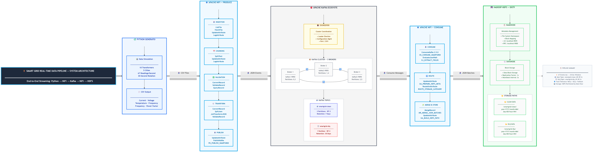

# Smart Grid Real-Time Data Pipeline — Technical Documentation

---

## 1. Introduction & Business Scenario

### 1.1 Project Overview

The Smart Grid Real-Time Data Pipeline is a distributed streaming data engineering system that simulates real-world smart electrical grid monitoring. The platform continuously generates telemetry data, processes it through seven streaming layers, validates quality, transforms events into canonical JSON, distributes events via Apache Kafka, and persists processed data in Hadoop HDFS.

The project demonstrates enterprise-grade data engineering concepts:

* Event-driven architectures
* Real-time streaming ingestion
* Distributed messaging and storage
* Fault tolerance and Dead Letter Queues
* Data quality enforcement
* Time-based partitioning
* Streaming observability and operational monitoring

---

### 1.2 Business Scenario

Modern smart electrical grids contain thousands of transformers and sensors continuously transmitting measurements: voltage, current, frequency, temperature, load conditions, and operational status. Electrical grid operators face critical challenges:

| Problem                   | Operational Risk        |
| ------------------------- | ----------------------- |
| Transformer overheating   | Equipment damage        |
| Voltage instability       | Grid failure            |
| Frequency fluctuations    | Power instability       |
| Missing telemetry         | Incomplete monitoring   |
| Delayed processing        | Slow incident response  |
| Corrupted sensor records  | Incorrect analytics     |
| Large streaming workloads | Infrastructure overload |

These events occur continuously and rapidly. The system therefore requires real-time ingestion, streaming validation, immediate event distribution, fault-tolerant processing, and scalable distributed storage.

---

## 2. System Architecture Overview

The system is composed of seven streaming layers connected through Apache NiFi and Apache Kafka.



```text
Python Generator
        ↓
Layer 1 — Streaming Ingestion
        ↓
Layer 2 — File Chunking (64 KB)
        ↓
Layer 3 — Data Cleansing & Validation
        ↓
Layer 4 — Data Transformation (CSV → Canonical JSON)
        ↓
Layer 5 — Kafka Streaming Distribution
        ↓
Layer 6 — Stream Consumption
        ↓
Layer 7 — HDFS Persistence
```

### 2.1 System Objectives

| Objective                | Description                            |
| ------------------------ | -------------------------------------- |
| Real-Time Streaming      | Continuous event processing            |
| Scalable Architecture    | Handle increasing workloads            |
| Fault Tolerance          | Best-effort no-data-loss architecture  |
| Data Quality Enforcement | Validate incoming records              |
| Streaming Decoupling     | Separate producers and consumers       |
| Distributed Persistence  | Store data efficiently                 |
| Operational Monitoring   | Observe runtime behavior               |

---

## 3. Core Design Principles

### 3.1 Decoupled Streaming Architecture

Apache Kafka decouples data producers from downstream consumers, enabling independent scaling, failure isolation, asynchronous processing, and flexible downstream integrations.

### 3.2 Layered Processing Model

The pipeline is divided into seven independent processing groups, each with a dedicated responsibility. This improves maintainability, modularity, scalability, and debugging simplicity.

### 3.3 Streaming-First Design

The architecture prioritizes continuous event processing over traditional batch execution, providing near real-time visibility, faster anomaly detection, lower operational latency, and continuous event delivery.

### 3.4 Fault-Tolerant Design

The system tolerates operational failures through failure routing, Dead Letter Queue architecture, retry strategies, back pressure handling, FlowFile penalization, and provenance tracking.

---

## 4. Technology Stack & Rationale

| Technology   | Purpose                                                       |
| ------------ | ------------------------------------------------------------- |
| Apache NiFi  | Visual streaming orchestration with 300+ processors           |
| Apache Kafka | Distributed event streaming with replication and partitioning |
| Hadoop HDFS  | Distributed storage with time-based partitioning              |
| Python       | Flexible telemetry generation with realistic defect simulation |
| JSON         | Interoperable event format with schema evolution              |
| Docker       | Reproducible multi-container orchestration                    |

---

## 5. Data Lifecycle

Data flows through nine sequential stages:

**Stage 1 — Data Generation:** Python generator creates CSV telemetry files with realistic defects (missing values, duplicates, corrupted rows, inconsistent timestamps).

All generation parameters — transformer count, readings per second, file rotation interval, 
error probabilities, and normal operating ranges — are configurable via the external 
`config.yaml` file located in `data_ingestion/config.yaml`. No changes to the Python code 
are required to modify pipeline behavior.

**Stage 2 — File Detection:** NiFi monitors the incoming directory using ListFile and FetchFile.

**Stage 3 — File Chunking:** SplitText divides large CSV files into 64 KB fragments for parallel processing.

**Stage 4 — Validation & Cleansing:** ConvertRecord parses CSV; ValidateRecord enforces Avro schema; QueryRecord classifies events via SQL.

**Stage 5 — Canonical JSON Transformation:** JoltTransformJSON normalizes structure; SplitJson separates arrays into individual events.

**Stage 6 — Kafka Streaming:** PublishKafka distributes events to topics with guaranteed delivery.

**Stage 7 — Stream Consumption:** ConsumeKafka reads events; EvaluateJsonPath extracts fields; RouteOnAttribute classifies records.

**Stage 8 — Batch Aggregation:** MergeRecord combines small events into 128 MB batches.

**Stage 9 — Distributed Persistence:** PutHDFS stores batches with time-based partitioning.

```json
{
  "transformer_id": "TR-102",
  "voltage": 228.4,
  "current": 15.2,
  "temperature": 44.1,
  "event_timestamp": "2026-05-20T02:10:11Z"
}
```

---

## 6. Layer 1 — Streaming Ingestion

**Purpose:** Detect incoming CSV files, retrieve content, and initialize pipeline metadata.

| Processor       | Responsibility         |
| --------------- | ---------------------- |
| ListFile        | Monitor incoming directory |
| FetchFile       | Read full CSV content   |
| UpdateAttribute | Add operational metadata |
| LogAttribute    | Debug and trace         |

**Design Decision:** ListFile and FetchFile are separated to improve scalability and operational visibility. ListFile runs every 5 seconds with 2-second minimum file age.

---

## 7. Layer 2 — File Chunking

**Purpose:** Split large CSV files into 64 KB processing fragments.

| Processor       | Purpose                     |
| --------------- | --------------------------- |
| SplitText       | Split into 64 KB chunks     |
| UpdateAttribute | Add fragment metadata       |
| PutFile         | Store failed chunks         |

Fragment metadata includes `fragment.index`, `fragment.count`, and `fragment.identifier`. Chunking enables parallel processing, lower memory pressure, and improved throughput.

---

## 8. Layer 3 — Data Validation

**Purpose:** Parse CSV, validate against Avro schema, and classify records via SQL.

| Processor      | Role               |
| -------------- | ------------------ |
| ConvertRecord  | CSV to record      |
| ValidateRecord | Schema enforcement |
| QueryRecord    | SQL classification |
| PutFile        | Failure storage    |

Invalid records route to `nifi_data/failed/invalid_schema/`. Corrupted records route to `nifi_data/failed/corrupted/`.

---

## 9. Layer 4 — Data Transformation

**Purpose:** Build canonical JSON events with stable structure for all downstream consumers.

| Processor         | Purpose              |
| ----------------- | -------------------- |
| ConvertRecord     | CSV to JSON          |
| SplitJson         | Event separation     |
| JoltTransformJSON | Structure normalization |
| ValidateRecord    | Final validation     |
| UpdateAttribute   | Event enrichment     |

---

## 10. Canonical Event Schema

All validated records are transformed into a standardized JSON schema before publishing to Kafka. This ensures consistent downstream processing and stable event contracts.

| Field | Type | Required | Description |
|-------|------|:---:|------|
| `transformer_id` | String | ✅ | Unique transformer identifier |
| `location` | String | ✅ | City and zone name |
| `voltage` | Double | ✅ | Voltage reading (220–240V) |
| `current` | Double | ✅ | Current reading (100–500A) |
| `frequency` | Double | ✅ | Grid frequency (59.8–60.2 Hz) |
| `power_mw` | Double | ✅ | Power in megawatts |
| `temperature` | Double | ✅ | Transformer temperature (30–65°C) |
| `status` | String | ✅ | Operational status (NORMAL, OUTAGE, OVERLOAD, FREQ_DRIFT, OVERHEAT) |
| `phase` | String | ✅ | Electrical phase (A, B, C) |
| `timestamp` | String | ✅ | Event timestamp (ISO 8601 after normalization) |
| `risk_level` | String | ✅ | Computed risk (NORMAL, WARNING, CRITICAL) |
| `processing_timestamp` | String | ✅ | Pipeline processing time |
| `pipeline_version` | String | ✅ | Pipeline version identifier |
| `source_file` | String | ❌ | Original CSV filename for traceability |

**Example Canonical Event:**

```json
{
  "transformer_id": "TRF-0004",
  "location": "Dammam-Central",
  "voltage": 238.90,
  "current": 1050.70,
  "frequency": 60.00,
  "power_mw": 251.20,
  "temperature": 118.50,
  "status": "OVERLOAD",
  "phase": "A",
  "timestamp": "2026-05-15T10:30:00.000Z",
  "risk_level": "CRITICAL",
  "processing_timestamp": "2026-05-15T10:30:02.456Z",
  "pipeline_version": "1.0.0"
}
```

---

## 11. Layer 5 — Kafka Streaming Distribution

**Purpose:** Publish validated JSON events to Kafka topics with guaranteed delivery.

| Processor       | Purpose                    |
| --------------- | -------------------------- |
| UpdateAttribute | Add Kafka metadata         |
| PublishKafka    | Publish to topics          |
| LogAttribute    | Log successful publishing  |
| PutFile         | Store permanently failed   |

**Topics:** `smartgrid-clean` (valid events, 3 partitions) and `smartgrid-dlq` (failed events, 1 partition). Features replicated delivery guarantee, DLQ routing, and 3 retry attempts.

---

## 12. Layer 6 — Stream Consumption

**Purpose:** Consume Kafka events and prepare HDFS storage metadata.

| Processor         | Purpose                      |
| ----------------- | ---------------------------- |
| ConsumeKafka      | Read from Kafka topics       |
| EvaluateJsonPath  | Extract key JSON fields      |
| UpdateAttribute   | Build HDFS partition paths   |
| RouteOnAttribute  | Classify before storage      |

---

## 13. Layer 7 — HDFS Persistence

**Purpose:** Aggregate events into optimized batches and persist to distributed storage.

| Processor       | Purpose                    |
| --------------- | -------------------------- |
| MergeRecord     | Batch aggregation          |
| UpdateAttribute | Build dynamic HDFS paths   |
| PutHDFS         | Store in Hadoop HDFS       |
| LogAttribute    | Log successful storage     |
| PutFile         | Store failed HDFS writes   |

**MergeRecord Configuration:**

| Parameter              | Value    |
| ---------------------- | -------- |
| Merge Strategy         | Bin-Packing Algorithm |
| Correlation Attribute  | `hdfs.path` |
| Min Records per Batch  | 100      |
| Max Records per Batch  | 1,000    |
| Max Bin Age            | 30 sec   |
| Max Number of Bins     | 10       |

---

## 14. Controller Services

Controller Services are shared configuration resources available at the NiFi Flow level.

### 14.1 Record Readers & Writers

| Service | Type | Used In |
|---------|------|---------|
| `SmartGridCSVReader` | CSVReader 2.9.0 | Data Validation, Data Transformation |
| `SmartGridCSVWriter` | CSVRecordSetWriter 2.9.0 | Data Validation |
| `SmartGridJsonReader` | JsonTreeReader 2.9.0 | Data Transformation |
| `SmartGridJsonWriter` | JsonRecordSetWriter 2.9.0 | Data Transformation |
| `SmartGridJSONWriter` | JsonRecordSetWriter 2.9.0 | Data Transformation |
| `JSON_READER` | JsonTreeReader 2.9.0 | HDFS Persistence |
| `JSON_WRITER` | JsonRecordSetWriter 2.9.0 | HDFS Persistence |

### 14.2 Kafka Connection Service

| Service | Type | Used In |
|---------|------|---------|
| `Kafka3ConnectionService` | Kafka3ConnectionService 2.9.0 | Streaming Distribution, Stream Consumption |

### 14.3 Layers Without Controller Services

| Layer | Reason |
|-------|--------|
| Streaming Ingestion (Layer 1) | Uses native filesystem operations only (ListFile, FetchFile) |
| File Chunking (Layer 2) | Uses SplitText which requires no record services |

---

## 15. Kafka Cluster Architecture

Kafka acts as the central streaming backbone with a 3-Broker cluster.

### 15.1 Cluster Configuration

| Broker   | INTERNAL       | EXTERNAL      | HOST              |
| -------- | -------------- | ------------- | ----------------- |
| kafka1   | kafka1:19092   | kafka1:9092   | localhost:29092   |
| kafka2   | kafka2:19093   | kafka2:9093   | localhost:29093   |
| kafka3   | kafka3:19094   | kafka3:9094   | localhost:29094   |

### 15.2 Topics

| Topic           | Partitions | RF  | Purpose                 |
| --------------- | :--------: | :-: | ----------------------- |
| smartgrid-clean |     3      |  3  | Valid production events |
| smartgrid-dlq   |     1      |  3  | Failed event isolation  |

### 15.3 Why Kafka?

Kafka decouples NiFi producers from consumers. Without Kafka, slow HDFS writes could block ingestion and system coupling would prevent independent scaling. With Kafka, producers and consumers scale independently, failures are isolated, and events can be replayed.

### 15.4 Topic Creation

```bash
docker exec -i kafka1 bash < kafka/create_topics.sh
```

### 15.5 Delivery Semantics

The Kafka producer is configured for **at-least-once delivery** with the following guarantees:

| Configuration | Value | Purpose |
|---------------|-------|---------|
| Delivery Guarantee | Guaranteed Replicated Delivery | Wait for replication before ACK |
| Maximum Retries | 3 | Retry transient failures |
| Retry Back Off Period | 5 sec | Progressive delay between retries |
| Replication Factor | 3 | Data copied to all 3 brokers |
| Min In-Sync Replicas | 2 | At least 2 replicas before ACK |
| Acknowledgment Wait Time | 30 sec | Maximum wait for broker ACK |

**Failure Scenarios:**

| Scenario | Behavior |
|----------|----------|
| Broker temporarily unavailable | Retry up to 3 times with 5-second backoff |
| All 3 retries exhausted | Route to `smartgrid-dlq` topic |
| DLQ publish also fails | Write to `nifi_data/failed/kafka/` via PutFile |
| Network partition | Producer buffers until connectivity restored |

---

## 16. HDFS Storage Strategy

### 16.1 Time-Based Partitioning

Data is organized using Hive-compatible partitioning:

```text
/smartgrid/year=YYYY/month=MM/day=DD/hour=HH
```

### 16.2 Benefits

* Faster queries via partition pruning
* Efficient historical data retrieval
* Scalable data lake organization
* Native Hive/Spark compatibility

### 16.3 Small File Problem

HDFS performs poorly with millions of tiny files — NameNode metadata grows excessively. MergeRecord solves this by aggregating events into 128 MB batches every 30 seconds or 1,000 records (whichever occurs first).

---

## 17. Queue Management & Back Pressure

### 17.1 Queue Controls

| Mechanism            | Purpose                      |
| -------------------- | ---------------------------- |
| Back Pressure        | Prevent queue explosion      |
| Penalization         | Delay problematic FlowFiles  |
| Yielding             | Protect processors from spam |
| FIFO Prioritization  | Maintain event ordering      |

### 17.2 Back Pressure Configuration

| Connection | Object Threshold | Size Threshold |
|-----------|:---:|:---:|
| SplitText → UpdateAttribute | 10,000 | 1 GB |
| ValidateRecord → QueryRecord | 10,000 | 1 GB |
| MergeRecord → PutHDFS | 10,000 | 1 GB |
| All other critical connections | 10,000 | 1 GB |

Without back pressure, a downstream outage would cause FlowFiles to accumulate indefinitely, leading to Out-Of-Memory crashes.

---

## 18. Failure Handling & DLQ Architecture

### 18.1 Failure Categories

| Failure Source | Destination | Purpose |
|---------------|-------------|---------|
| ValidateRecord (invalid) | `nifi_data/failed/invalid_schema/` | Schema violations |
| ConvertRecord (corrupted) | `nifi_data/failed/corrupted/` | Parse failures |
| PublishKafka (3 retries exhausted) | `smartgrid-dlq` Kafka topic | Isolate failed messages |
| PublishKafka DLQ (if fails) | `nifi_data/failed/kafka/` | Final fallback to disk |
| PutHDFS (failure) | `nifi_data/failed/hdfs/` | Storage failures |

### 18.2 DLQ Data Flow

```
PublishKafka (3 retries exhausted)
        │
        ▼
PublishKafka DLQ → smartgrid-dlq (Kafka Topic)
        │
        ├── success → ConsumeKafka → HDFS /smartgrid/dlq/
        │
        └── failure → PutFile → nifi_data/failed/kafka/
```

### 18.3 Data Loss Prevention

The pipeline is designed to minimize data loss through durable routing and persistent failure isolation. Every record has a configured persistent destination — either the clean HDFS path (`/smartgrid/clean/`), the DLQ HDFS path (`/smartgrid/dlq/`), or a local failure directory (`nifi_data/failed/`). No record is silently discarded; all failure paths end in persistent storage.

**Protection Mechanisms:**

| Layer | Mechanism | Failure Destination |
|-------|-----------|-------------------|
| Validation | Schema enforcement | `failed/invalid_schema/` |
| Parsing | Error isolation | `failed/corrupted/` |
| Kafka Publishing | Native retry (3×) + DLQ topic | `smartgrid-dlq` → HDFS |
| Kafka DLQ | Final fallback to disk | `failed/kafka/` |
| HDFS Writing | Retry + error routing | `failed/hdfs/` |

---

## 19. Monitoring & Observability

### 19.1 Monitoring Components

| Component         | Tool                  |
| ----------------- | --------------------- |
| Data Lineage      | NiFi Provenance       |
| Queue Metrics     | NiFi Summary Page     |
| Real-time Alerts  | NiFi Bulletin Board   |
| Consumer Lag      | Kafka UI (:8080)      |
| Storage Status    | NameNode UI (:9870)   |
| Container Health  | `docker ps`           |

### 19.2 Provenance Events

| Event   | Example           |
| ------- | ----------------- |
| CREATE  | File ingestion    |
| RECEIVE | Kafka consumption |
| MODIFY  | Transformation    |
| SEND    | Kafka publishing  |
| DROP    | Failure discard   |

---

## 20. Engineering Challenges & Solutions

| # | Challenge                        | Impact                    | Status |
|---|----------------------------------|---------------------------|:------:|
| 1 | Duplicate File Names             | Data loss                 | ✅ Solved |
| 2 | MergeRecord Removing Filenames   | Unidentifiable files      | ✅ Solved |
| 3 | Empty HDFS Partition Paths       | Storage structure broken  | ✅ Solved |
| 4 | Small File Explosion             | NameNode pressure         | ✅ Solved |
| 5 | Invalid Schema Records           | Pipeline contamination    | ✅ Solved |
| 6 | Kafka Publishing Failures        | Event loss risk           | ✅ Solved |
| 7 | Queue Back Pressure              | System instability        | ✅ Solved |
| 8 | HDFS Path Resolution Failure     | Storage structure incorrect | ✅ Solved |

---

### 20.1 Challenge 1 — Duplicate File Names

**Problem:** Millisecond timestamps caused duplicate filenames under high-speed generation, leading to file overwriting and missing records.

**Root Cause:** Timestamp precision insufficient for high-frequency generation.

**Solution:** UUID fragments appended to filenames.

```text
Before: grid_20260520_022839_000.csv
After:  grid_a3f2c1b4_20260520_022839.csv
```

**Result:** Unique filenames guaranteed, no overwrite collisions.

---

### 20.2 Challenge 2 — MergeRecord Removing Filenames

**Problem:** After MergeRecord, filenames became UUIDs, making files unidentifiable.

**Root Cause:** MergeRecord generates new FlowFiles internally; original attributes are not preserved.

**Solution:** UpdateAttribute processor inserted after MergeRecord to rebuild filename, hdfs.path, and partition attributes.

**Result:** Clean HDFS filenames, consistent batch naming.

---

### 20.3 Challenge 3 — Empty HDFS Partition Paths

**Problem:** HDFS directories appeared as `/year=/month=/day=/hour=`.

**Root Cause:** Partition attributes lost after MergeRecord regeneration.

**Solution:** Attributes reconstructed after MergeRecord using UpdateAttribute.

**Result:** Correct structure: `/year=2026/month=05/day=20/hour=02`.

---

### 20.4 Challenge 4 — Small File Explosion

**Problem:** Kafka consumers generated thousands of tiny JSON files causing NameNode pressure.

**Solution:** MergeRecord batching with 100–1,000 records and 30-second bin age.

**Result:** Larger HDFS files, lower metadata overhead.

---

### 20.5 Challenge 5 — Invalid Schema Records

**Problem:** Malformed CSV rows caused schema validation failures.

**Solution:** ValidateRecord isolated invalid events to `invalid_schema/` and `corrupted/` directories.

**Result:** Clean pipeline continuity, failure isolation.

---

### 20.6 Challenge 6 — Kafka Publishing Failures

**Problem:** Temporary broker unavailability caused delivery failures.

**Solution:** Failed events routed to `smartgrid-dlq` topic and `failed/kafka/` directory.

**Result:** No silent data loss, operational resilience.

---

### 20.7 Challenge 7 — Queue Back Pressure

**Problem:** Heavy streaming loads caused downstream slowdown and queue growth.

**Solution:** Back pressure thresholds configured; queue monitoring mandated.

**Result:** Stable throughput, controlled memory usage.

---

### 20.8 Challenge 8 — HDFS Path Resolution Failure

**Problem:** HDFS files were written to `/year=2026/...` instead of `/smartgrid/year=2026/...`. The `hdfs.path` attribute resolved without the `/smartgrid` prefix despite `hdfs.base.path` being defined.

**Root Cause:** NiFi does not resolve `${attribute}` references to other attributes defined within the same UpdateAttribute processor. When `hdfs.path` referenced `${hdfs.base.path}`, the expression evaluated to empty because `hdfs.base.path` was not yet part of the FlowFile's attribute state at evaluation time.

**Solution:** The intermediate attribute was removed. `hdfs.path` was rewritten to use the full path directly:
```
hdfs.path = /smartgrid/year=${storage.year}/month=${storage.month}/day=${storage.day}/hour=${storage.hour}
```

**Result:** All HDFS files now write to the correct `/smartgrid/` directory tree. The structure is compatible with Hive-style partition discovery.


Final HDFS output structure became:

```text
/smartgrid
 └── year=2026
      └── month=05
           └── day=24
                └── hour=03
                     └── smartgrid_batch_....json
```

This also ensured compatibility with downstream Hive-style partition discovery.

---

## 21. Operational Reliability Configuration

### 21.1 Overview

The Operational Reliability Layer is a collection of runtime configurations distributed across all seven pipeline layers ensuring stability, resilience, observability, and production-grade behavior.

### 21.2 Key Mechanisms

| # | Mechanism | Where Applied | Key Setting |
|---|-----------|--------------|-------------|
| 1 | Back Pressure | Critical Connections | 10,000 objects / 1 GB |
| 2 | FIFO Prioritizer | Layer 1 & 6 Connections | FirstInFirstOutPrioritizer |
| 3 | Native Retry | PublishKafka (Layer 5) | 3 retries, 5 sec backoff |
| 4 | Dead Letter Queue | Layer 5 | `smartgrid-dlq` Kafka topic |
| 5 | Penalty Duration | All critical processors | 30 seconds |
| 6 | Yield Duration | All critical processors | 1 second |
| 7 | Error Storage | Layers 2,3,5,7 | `nifi_data/failed/*` |
| 8 | Provenance | Entire pipeline | Default (enabled) |
| 9 | Bulletin Level | All processors | WARN |
| 10 | Filesystem Permissions | Host machine | `chmod -R 777 nifi_data/failed/` |

### 21.3 Why Penalty & Yield Matter

If Kafka becomes completely unavailable, Yield Duration (1 sec) prevents NiFi from processing all queued FlowFiles instantly, which would spike CPU to 100%. Penalty Duration (30 sec) sets aside failed FlowFiles so healthy ones proceed. Together they act as a hydraulic shock absorber.

### 21.4 Why FIFO Matters

Smart grid telemetry is time-series data. Processing events out of order could produce incorrect analytics. FIFO ensures chronological processing on time-sensitive queues.

---

## 22. Operations Guide

### 22.1 Environment Deployment

```bash
cd "Smart-Grid-Real-Time-Pipeline-Project"
docker compose up -d
```

This initializes NiFi, Kafka (3 brokers), ZooKeeper, HDFS NameNode, HDFS DataNode, and Kafka UI.

### 22.2 Service Access

| Service            | URL                           |
| ------------------ | ----------------------------- |
| Apache NiFi        | https://localhost:8443/nifi   |
| Hadoop HDFS        | http://localhost:9870         |
| Kafka UI           | http://localhost:8080         |
| Kafka Brokers      | localhost:9092/9093/9094      |

### 22.3 Runtime Execution Sequence

1. Start Docker containers (`docker compose up -d`)
2. Verify Kafka broker health (`docker ps`)
3. Create Kafka topics (`docker exec -i kafka1 bash < kafka/create_topics.sh`)
4. Import NiFi flow:
   - Open https://localhost:8443/nifi
   - Right-click on canvas → **Upload Process Group**
   - Select `../nifi-flow/smart_grid_pipeline.json`
   - Click **Upload**
5. Enable Controller Services (lightning bolt icon)
6. Start all Process Groups (right-click → Start)
7. Run Python generator (`python smart_grid_generator.py`)

### 22.4 Generator Execution

```bash
cd data_ingestion
pip install -r ../requirements.txt
python smart_grid_generator.py
```
To modify generation parameters (transformers, readings/sec, error rates, etc.), 
edit `config.yaml` before running the generator. The Python script reads all settings 
from this file at startup.

### 22.5 Operational Best Practices

| Practice                    | Reason                      | Verification                  |
| --------------------------- | --------------------------- | ----------------------------- |
| Start Kafka before NiFi     | Prevent connection failures | `docker ps`                   |
| Monitor queues continuously | Detect bottlenecks          | NiFi Summary Page             |
| Check DLQ regularly         | Detect hidden failures      | `hdfs dfs -ls /smartgrid/dlq` |
| Verify Controller Services  | Prevent flow failures       | NiFi Controller Settings      |
| Monitor HDFS storage        | Prevent fragmentation       | `hdfs dfsadmin -report`       |

### 22.6 Project Structure

```text
Smart-Grid-Real-Time-Pipeline-Project/
│
├── docker-compose.yml
├── hadoop.env
├── requirements.txt
├── README.md
│
├── data_ingestion/
│   ├── output/
│   ├── config.yaml
│   └── smart_grid_generator.py
│
├── kafka/
│   └── create_topics.sh
│
├── hadoop/
│   └── config/
│       ├── core-site.xml
│       └── hdfs-site.xml
│
├── nifi/
│   ├── conf/
│   ├── drivers/
│   ├── extensions/
│   ├── database_repo/
│   ├── flowfile_repo/
│   ├── content_repo/
│   └── provenance_repo/
│
└── nifi_data/
    ├── incoming/
    ├── archive/
    └── failed/
        ├── corrupted/
        ├── hdfs/
        ├── invalid_schema/
        └── kafka/
```

### 22.7 Generated Fields (Data Dictionary)

| Field            | Type    | Normal Range      |
| ---------------- | ------- | ----------------- |
| transformer_id   | String  | TRF-0001–TRF-0010 |
| location         | String  | 10 locations      |
| voltage          | Double  | 220–240V          |
| current          | Double  | 100–500A          |
| frequency        | Double  | 59.8–60.2Hz       |
| power_mw         | Double  | 22–120MW          |
| temperature      | Double  | 30–65°C           |
| status           | String  | NORMAL/OUTAGE/..  |
| phase            | String  | A/B/C             |
| timestamp        | String  | Multiple formats  |

### 22.8 Runtime Resource Allocation

Recommended resource allocation for Docker containers:

**Note:** Values are for development environment. Production requires higher allocations.

| Service | CPU Cores | RAM | Disk | Notes |
|---------|:---:|:---:|------|------|
| Apache NiFi | 2 | 4 GB | 10 GB | Increases with FlowFile volume |
| Kafka Broker 1 | 1 | 2 GB | 5 GB | Log retention: 7 days |
| Kafka Broker 2 | 1 | 2 GB | 5 GB | Log retention: 7 days |
| Kafka Broker 3 | 1 | 2 GB | 5 GB | Log retention: 7 days |
| ZooKeeper | 1 | 1 GB | 2 GB | Minimal for dev |
| HDFS NameNode | 1 | 2 GB | 5 GB | Metadata only |
| HDFS DataNode | 1 | 2 GB | 10 GB | Actual data blocks |
| Kafka UI | 0.5 | 512 MB | 1 GB | Lightweight |
| **Total** | **8.5** | **15.5 GB** | **43 GB** | Minimum recommended |

**Lightweight Profile** (for limited hardware):

| Service | CPU | RAM |
|---------|:---:|:---:|
| NiFi | 1 | 2 GB |
| Kafka (single broker) | 1 | 1 GB |
| HDFS (NameNode + DataNode) | 1 | 2 GB |
| **Total** | **3** | **5 GB** |

---

## 23. Security & Access Controls

While the project operates in a local development environment, several security measures are implemented to isolate services and protect data.

### 23.1 Network Isolation

| Mechanism | Implementation | Purpose |
|-----------|---------------|---------|
| Docker Bridge Network | `data_network` (internal only) | Isolate all services from host network |
| Kafka INTERNAL Listeners | Ports 19092–19094 | Inter-broker communication never exposed externally |
| HDFS Communication | Internal Docker DNS | NameNode ↔ DataNode communication isolated |
| NiFi HTTPS | Port 8443 with self-signed certificate | Encrypted UI access |

### 23.2 Service Access

| Service | Access Level | Notes |
|---------|-------------|------|
| NiFi UI | Localhost only (HTTPS) | Credentials: admin / 12-char password |
| Kafka Brokers | EXTERNAL: localhost:9092–9094 | Mapped for local development |
| Kafka Brokers | INTERNAL: container network only | Not exposed to host |
| HDFS NameNode UI | Localhost:9870 | Read-only browsing |
| Kafka UI | Localhost:8080 | Monitoring only, no write access |

### 23.3 Filesystem Security

| Location | Permissions | Rationale |
|----------|:---:|------|
| `nifi_data/failed/` | 777 | Allow NiFi container to write failure records |
| `hadoop/config/` | Read-only (`:ro`) | Prevent accidental modification |
| `nifi/conf/` | Standard | NiFi configuration, limited access |

### 23.4 Data Isolation

| Data Category | Storage Location | Access Pattern |
|---------------|-----------------|----------------|
| Clean events | HDFS `/smartgrid/clean/` | Analytical queries |
| Failed events | HDFS `/smartgrid/dlq/` | Debugging and reprocessing |
| Schema violations | `nifi_data/failed/invalid_schema/` | Manual inspection |
| Parse failures | `nifi_data/failed/corrupted/` | Manual inspection |
| Kafka failures | `nifi_data/failed/kafka/` | Pipeline diagnostics |
| HDFS failures | `nifi_data/failed/hdfs/` | Storage diagnostics |

---

## 24. Recovery Procedures

### 24.1 Kafka Broker Down

**Symptom:** PublishKafka processors report connection failures. Messages route to DLQ.

**Recovery Steps:**

```bash
# 1. Identify failed broker
docker ps | grep kafka

# 2. Restart the failed broker
docker compose restart kafka2

# 3. Verify cluster health
docker exec kafka1 kafka-topics --list --bootstrap-server kafka1:19092

# 4. Verify replication restored
docker exec kafka1 kafka-topics --describe --topic smartgrid-clean --bootstrap-server kafka1:19092
```

**Expected Result:** Broker rejoins cluster within 30 seconds. Replication resumes automatically. DLQ messages can be replayed.

---

### 24.2 NiFi Restart

**Symptom:** NiFi UI unavailable. FlowFiles not processing.

**Recovery Steps:**

```bash
# 1. Restart NiFi container
docker compose restart nifi

# 2. Wait for UI (30-60 seconds)
# Open: https://localhost:8443/nifi

# 3. Verify all Controller Services are enabled
# NiFi → Controller Settings → Services

# 4. Start any stopped Process Groups
# Right-click each Process Group → Start
```

**Expected Result:** NiFi resumes with all FlowFile state intact (persistent repositories). Pending FlowFiles continue processing.

---

### 24.3 HDFS DataNode Failure

**Symptom:** PutHDFS processors report write failures. Files route to `failed/hdfs/`.

**Recovery Steps:**

```bash
# 1. Check HDFS health
docker exec hdfs_namenode hdfs dfsadmin -report

# 2. Restart DataNode
docker compose restart datanode

# 3. Verify DataNode reconnects
# Open http://localhost:9870 → Datanodes tab
# Should show 1 live node

# 4. Retry failed HDFS writes
# Move files from nifi_data/failed/hdfs/ back to incoming
```

**Expected Result:** DataNode reconnects within 30 seconds. Block reports complete. New writes succeed.

---

### 24.4 Full System Recovery

If the entire environment needs to be rebuilt:

```bash
# 1. Stop everything
docker compose down

# 2. Restart (preserves persistent volumes)
docker compose up -d

# 3. Wait for all services
sleep 30

# 4. Create topics
docker exec -i kafka1 bash < kafka/create_topics.sh

# 5. Import NiFi flow via UI or API
# Right-click → Upload Process Group → smart_grid_pipeline.json

# 6. Enable Controller Services
# 7. Start all Process Groups
# 8. Run generator
cd data_ingestion && python smart_grid_generator.py
```

---

### 24.5 DLQ Replay

Failed messages stored in `smartgrid-dlq` can be reprocessed:

```bash
# 1. Check DLQ message count
docker exec kafka1 kafka-run-class kafka.tools.GetOffsetShell \
  --broker-list kafka1:19092 --topic smartgrid-dlq

# 2. Consume and inspect DLQ messages
docker exec kafka1 kafka-console-consumer \
  --bootstrap-server kafka1:19092 \
  --topic smartgrid-dlq --max-messages 5

# 3. To replay: The DLQ consumer already routes to HDFS /smartgrid/dlq/
# For manual reprocessing: copy messages to smartgrid-clean topic
```

---

## 25. Future Improvements

* Apache Spark Streaming for real-time analytics
* Kubernetes deployment for cloud-native orchestration
* Grafana + Prometheus observability stack
* Apache Iceberg / Delta Lake for ACID transactions
* Schema Registry for Avro/Protobuf governance
* Machine learning anomaly detection on transformer behavior
* Real-time alerting and notification system
* CI/CD pipeline for automated deployment

---

## 26. Testing & Validation Scenarios

The pipeline was tested against the following scenarios to validate fault tolerance and data integrity.

### 26.1 Data Quality Tests

| Test | Input | Expected Result | Verified |
|------|-------|-----------------|:---:|
| Missing voltage field | CSV with empty voltage | Routed to `failed/invalid_schema/` | ✅ |
| Negative current | CSV with `current=-500` | Routed to `failed/invalid_schema/` | ✅ |
| Corrupted row | Garbage text in CSV | Routed to `failed/corrupted/` | ✅ |
| Duplicate filenames | Same timestamp files | UUID ensures unique filenames | ✅ |
| Multiple timestamp formats | Mixed date formats | Normalized to ISO 8601 | ✅ |
| Extreme temperature | `temperature=250` | Classified as CRITICAL risk | ✅ |

### 26.2 Fault Tolerance Tests

| Test | Simulation | Expected Result | Verified |
|------|-----------|-----------------|:---:|
| Kafka broker down | `docker stop kafka2` | Messages retry 3×, then route to DLQ | ✅ |
| Kafka full cluster down | `docker stop kafka1 kafka2 kafka3` | NiFi yields, no crash, back pressure activates | ✅ |
| HDFS DataNode down | `docker stop datanode` | Writes fail, route to `failed/hdfs/` | ✅ |
| NiFi restart | `docker restart nifi` | FlowFiles preserved, processing resumes | ✅ |
| High ingestion load | Generator at 200 readings/sec | Queues stable, back pressure prevents OOM | ✅ |

### 26.3 Data Integrity Tests

| Test | Method | Expected Result | Verified |
|------|--------|-----------------|:---:|
| End-to-end record count | Count CSV rows vs HDFS JSON records | Valid records match (minus failures) | ✅ |
| Schema compliance | ValidateRecord checks | All passing records match Avro schema | ✅ |
| Partition accuracy | Check HDFS directory names | Correct year=/month=/day=/hour= | ✅ |
| DLQ isolation | Check DLQ topic | Only failed records in `smartgrid-dlq` | ✅ |

### 26.4 Performance Tests

| Metric | Target | Observed |
|--------|--------|----------|
| Ingestion latency | < 5 seconds from CSV to NiFi | ~2 seconds |
| End-to-end latency | < 30 seconds from generator to HDFS | ~15–20 seconds |
| Kafka throughput | 1,000+ messages/sec | Achieved |
| MergeRecord batch time | 30 seconds max | Batches close at 30 sec or 1,000 records |
| Queue stability | No queue exceeding 10,000 | Back pressure maintains limits |

---

## 27. Conclusion

The Smart Grid Real-Time Data Pipeline demonstrates a production-oriented streaming architecture integrating real-time ingestion, event streaming, validation, canonical transformation, distributed storage, monitoring, failure handling, and operational observability into a unified scalable platform. The project emphasizes not only functional streaming behavior, but the engineering practices required to build resilient and scalable data infrastructure systems.