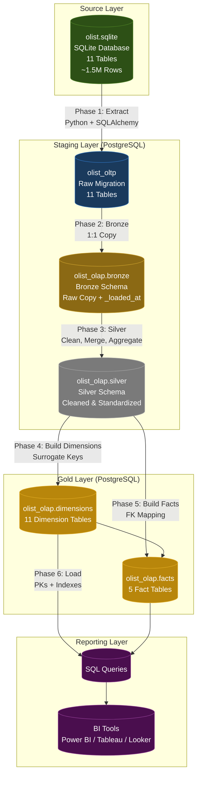

# Architecture Diagram


```mermaid
flowchart TD
    subgraph Source ["Source Layer"]
        A[("olist.sqlite<br/>SQLite Database<br/>11 Tables<br/>~1.5M Rows")]
    end

    subgraph Staging ["Staging Layer (PostgreSQL)"]
        B[("olist_oltp<br/>Raw Migration<br/>11 Tables")]
        C[("olist_olap.bronze<br/>Bronze Schema<br/>Raw Copy + _loaded_at")]
        D[("olist_olap.silver<br/>Silver Schema<br/>Cleaned & Standardized")]
    end

    subgraph Gold ["Gold Layer (PostgreSQL)"]
        E[("olist_olap.dimensions<br/>11 Dimension Tables")]
        F[("olist_olap.facts<br/>5 Fact Tables")]
    end

    subgraph Reporting ["Reporting Layer"]
        G[("SQL Queries")]
        H[("BI Tools<br/>Power BI / Tableau / Looker")]
    end

    A -->|"Phase 1: Extract<br/>Python + SQLAlchemy"| B
    B -->|"Phase 2: Bronze<br/>1:1 Copy"| C
    C -->|"Phase 3: Silver<br/>Clean, Merge, Aggregate"| D
    D -->|"Phase 4: Build Dimensions<br/>Surrogate Keys"| E
    D -->|"Phase 5: Build Facts<br/>FK Mapping"| F
    E --> F
    E -->|"Phase 6: Load<br/>PKs + Indexes"| G
    F --> G
    G --> H

    style A fill:#2d5016,stroke:#4a7c23,color:#fff
    style B fill:#1a3a5c,stroke:#2d6db5,color:#fff
    style C fill:#8b6914,stroke:#c49b2a,color:#fff
    style D fill:#7a7a7a,stroke:#a0a0a0,color:#fff
    style E fill:#b8860b,stroke:#daa520,color:#fff
    style F fill:#b8860b,stroke:#daa520,color:#fff
    style G fill:#4a0e4e,stroke:#8b3a8f,color:#fff
    style H fill:#4a0e4e,stroke:#8b3a8f,color:#fff
```
```
