# Medallion Architecture Layers

```mermaid
flowchart LR
    subgraph Bronze ["🟤 Bronze Layer"]
        direction TB
        B1["Raw data from OLTP"]
        B2["No transformations"]
        B3["Added _loaded_at"]
        B4["Preserves original state"]
    end

    subgraph Silver ["⚪ Silver Layer"]
        direction TB
        S1["Cleaned & standardized"]
        S2["Merged leads tables"]
        S3["Aggregated geolocation"]
        S4["English category names"]
        S5["Proper data types"]
    end

    subgraph Gold ["🟡 Gold Layer"]
        direction TB
        G1["Star Schema"]
        G2["Surrogate keys"]
        G3["11 Dimensions"]
        G4["5 Fact tables"]
        G5["18 Performance indexes"]
    end

    Bronze --> Silver --> Gold

    style Bronze fill:#8b6914,color:#fff
    style Silver fill:#7a7a7a,color:#fff
    style Gold fill:#b8860b,color:#fff
```



### Layer Purposes

| Layer | Purpose | User |
|-------|---------|------|
| **Bronze** | Historical archive, reprocessing source | Data Engineers |
| **Silver** | Clean data for exploratory analysis | Data Analysts |
| **Gold** | Business-ready star schema for reporting | Business Users, BI Tools |
```
