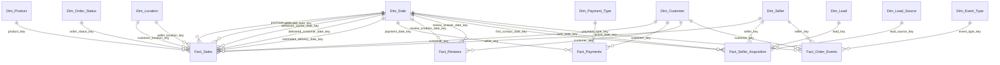

# Star Schema Diagram


```mermaid
erDiagram
    Dim_Date ||--o{ Fact_Sales : purchase_date_key
    Dim_Date ||--o{ Fact_Sales : approved_date_key
    Dim_Date ||--o{ Fact_Sales : delivered_carrier_date_key
    Dim_Date ||--o{ Fact_Sales : delivered_customer_date_key
    Dim_Date ||--o{ Fact_Sales : estimated_delivery_date_key
    Dim_Date ||--o{ Fact_Payments : payment_date_key
    Dim_Date ||--o{ Fact_Reviews : review_creation_date_key
    Dim_Date ||--o{ Fact_Reviews : review_answer_date_key
    Dim_Date ||--o{ Fact_Seller_Acquisition : first_contact_date_key
    Dim_Date ||--o{ Fact_Seller_Acquisition : won_date_key
    Dim_Date ||--o{ Fact_Order_Events : event_date_key

    Dim_Customer ||--o{ Fact_Sales : customer_key
    Dim_Customer ||--o{ Fact_Payments : customer_key
    Dim_Customer ||--o{ Fact_Reviews : customer_key
    Dim_Customer ||--o{ Fact_Order_Events : customer_key

    Dim_Seller ||--o{ Fact_Sales : seller_key
    Dim_Seller ||--o{ Fact_Seller_Acquisition : seller_key
    Dim_Seller ||--o{ Fact_Order_Events : seller_key

    Dim_Product ||--o{ Fact_Sales : product_key

    Dim_Order_Status ||--o{ Fact_Sales : order_status_key

    Dim_Payment_Type ||--o{ Fact_Payments : payment_type_key

    Dim_Lead ||--o{ Fact_Seller_Acquisition : lead_key
    Dim_Lead_Source ||--o{ Fact_Seller_Acquisition : lead_source_key
    Dim_Event_Type ||--o{ Fact_Order_Events : event_type_key

    Dim_Location ||--o{ Fact_Sales : customer_location_key
    Dim_Location ||--o{ Fact_Sales : seller_location_key
```
```
